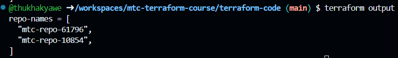
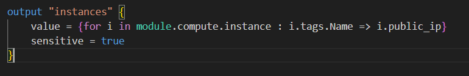
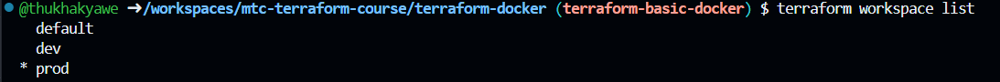
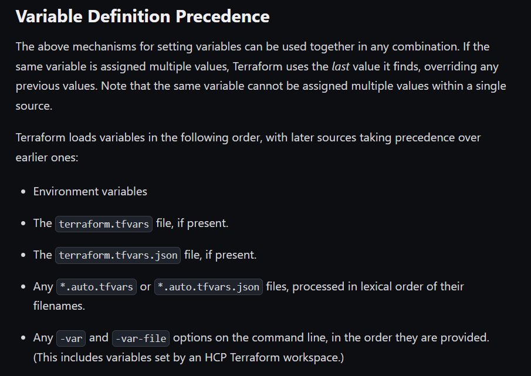

# mtc-terraform-course
More Than Certified Terraform

Commands List

<span style="color: green;">For Github Token Remove and Access</span>

```
unset GITHUB_TOKEN && gh auth login -h github.com -p https -s delete_repo -w
```

<span style="color: green;">For Terraform File Format</span>

```
terraform fmt
```

<span style="color: green;">For Download Terraform Configuration Files</span>

```
terraform init
```

<span style="color: green;">For Deploy Terraform Configuration</span>

```
terraform apply
```

<span style="color: green;">For Deploy Terraform Configuration Without Confirmation</span>

```

terraform apply -auto-approve  
```

<span style="color: green;">For Show Terraform Configuration Details</span>

```
terraform show
```

<span style="color: green;">For Show Terraform Configuration Details as Json Format</span>

```
terraform show -json | jq
```

<span style="color: green;">For Destroy Terraform Configuration</span>

```
terraform destroy
```

<span style="color: green;">For Destroy Terraform Configuration without confirmation</span>

```
terraform destroy -auto-approve
```

<span style="color: green;">For Show Terraform State Files Without Any Other Information</span>

```
terraform state list
```

<span style="color: green;">For Show Terraform State Legacy option for the local backend only</span>

```
terraform console -state=path
```
Example Code 

```
@thukhakyawe ➜ /workspaces/mtc-terraform-course/terraform-code (main) $ terraform console -state="../state/terraform.tfstate"
> random_id.random
{
  "b64_std" = "PPI="
  "b64_url" = "PPI"
  "byte_length" = 2
  "dec" = "15602"
  "hex" = "3cf2"
  "id" = "PPI"
  "keepers" = tomap(null) /* of string */
  "prefix" = tostring(null)
}
> random_id.random.dec
"15602"
> "mtc-repo"
"mtc-repo"
> "mtc-repo-${random_id.random.dec}"
"mtc-repo-15602"
> "mtc-repo-${random_id.random.id}"
"mtc-repo-PPI"
> "mtc-repo-${random_id.random.hex}"
"mtc-repo-3cf2
```

<span style="color: green;">For Show Terraform Output Results</span>

```
terraform output
```



<span style="color: green;">For Show Terraform Output With Output Name</span>

```
terraform output -json repo-names
```


<span style="color: green;">For Show Terraform Output With Json Format</span>

```
terraform output -json
```




<span style="color: green;">For Show Terraform Plan With '-var varsource=cli'</span>

```
terraform plan -var 'varsource=cli'
```

Example Result
```
@thukhakyawe ➜ /workspaces/mtc-terraform-course/terraform-code (main) $ terraform plan -var 'varsource=cli'

Terraform used the selected providers to generate the following execution plan. Resource actions are indicated with the following symbols:
  + create

Terraform will perform the following actions:

  # github_repository.mtc_repo[0] will be created
  + resource "github_repository" "mtc_repo" {
      + allow_auto_merge            = false
      + allow_merge_commit          = true
      + allow_rebase_merge          = true
      + allow_squash_merge          = true
      + archived                    = false
      + auto_init                   = true
      + default_branch              = (known after apply)
      + delete_branch_on_merge      = false
      + description                 = "Code for MTC"
      + etag                        = (known after apply)
      + full_name                   = (known after apply)
      + git_clone_url               = (known after apply)
      + html_url                    = (known after apply)
      + http_clone_url              = (known after apply)
      + id                          = (known after apply)
      + merge_commit_message        = "PR_TITLE"
      + merge_commit_title          = "MERGE_MESSAGE"
      + name                        = (known after apply)
      + node_id                     = (known after apply)
      + primary_language            = (known after apply)
      + private                     = (known after apply)
      + repo_id                     = (known after apply)
      + squash_merge_commit_message = "COMMIT_MESSAGES"
      + squash_merge_commit_title   = "COMMIT_OR_PR_TITLE"
      + ssh_clone_url               = (known after apply)
      + svn_url                     = (known after apply)
      + topics                      = (known after apply)
      + visibility                  = "private"
      + web_commit_signoff_required = false

      + security_and_analysis (known after apply)
    }

  # github_repository.mtc_repo[1] will be created
  + resource "github_repository" "mtc_repo" {
      + allow_auto_merge            = false
      + allow_merge_commit          = true
      + allow_rebase_merge          = true
      + allow_squash_merge          = true
      + archived                    = false
      + auto_init                   = true
      + default_branch              = (known after apply)
      + delete_branch_on_merge      = false
      + description                 = "Code for MTC"
      + etag                        = (known after apply)
      + full_name                   = (known after apply)
      + git_clone_url               = (known after apply)
      + html_url                    = (known after apply)
      + http_clone_url              = (known after apply)
      + id                          = (known after apply)
      + merge_commit_message        = "PR_TITLE"
      + merge_commit_title          = "MERGE_MESSAGE"
      + name                        = (known after apply)
      + node_id                     = (known after apply)
      + primary_language            = (known after apply)
      + private                     = (known after apply)
      + repo_id                     = (known after apply)
      + squash_merge_commit_message = "COMMIT_MESSAGES"
      + squash_merge_commit_title   = "COMMIT_OR_PR_TITLE"
      + ssh_clone_url               = (known after apply)
      + svn_url                     = (known after apply)
      + topics                      = (known after apply)
      + visibility                  = "private"
      + web_commit_signoff_required = false

      + security_and_analysis (known after apply)
    }

  # github_repository_file.index[0] will be created
  + resource "github_repository_file" "index" {
      + branch              = "main"
      + commit_message      = (known after apply)
      + commit_sha          = (known after apply)
      + content             = "# Hello, Terraform!"
      + file                = "index.html"
      + id                  = (known after apply)
      + overwrite_on_create = true
      + ref                 = (known after apply)
      + repository          = (known after apply)
      + sha                 = (known after apply)
    }

  # github_repository_file.index[1] will be created
  + resource "github_repository_file" "index" {
      + branch              = "main"
      + commit_message      = (known after apply)
      + commit_sha          = (known after apply)
      + content             = "# Hello, Terraform!"
      + file                = "index.html"
      + id                  = (known after apply)
      + overwrite_on_create = true
      + ref                 = (known after apply)
      + repository          = (known after apply)
      + sha                 = (known after apply)
    }

  # github_repository_file.readme[0] will be created
  + resource "github_repository_file" "readme" {
      + branch              = "main"
      + commit_message      = (known after apply)
      + commit_sha          = (known after apply)
      + content             = "# This is for infra developers"
      + file                = "README.md"
      + id                  = (known after apply)
      + overwrite_on_create = true
      + ref                 = (known after apply)
      + repository          = (known after apply)
      + sha                 = (known after apply)
    }

  # github_repository_file.readme[1] will be created
  + resource "github_repository_file" "readme" {
      + branch              = "main"
      + commit_message      = (known after apply)
      + commit_sha          = (known after apply)
      + content             = "# This is for infra developers"
      + file                = "README.md"
      + id                  = (known after apply)
      + overwrite_on_create = true
      + ref                 = (known after apply)
      + repository          = (known after apply)
      + sha                 = (known after apply)
    }

  # random_id.random[0] will be created
  + resource "random_id" "random" {
      + b64_std     = (known after apply)
      + b64_url     = (known after apply)
      + byte_length = 2
      + dec         = (known after apply)
      + hex         = (known after apply)
      + id          = (known after apply)
    }

  # random_id.random[1] will be created
  + resource "random_id" "random" {
      + b64_std     = (known after apply)
      + b64_url     = (known after apply)
      + byte_length = 2
      + dec         = (known after apply)
      + hex         = (known after apply)
      + id          = (known after apply)
    }

Plan: 8 to add, 0 to change, 0 to destroy.

Changes to Outputs:
  + clone-urls = (known after apply)
  + varsource  = "cli"

```

<span style="color: green;">For Show Terraform Plan With -var-file="prod.tfvars"</span>

```
terraform plan -var 'varsource=cli' -var-file="prod.tfvars"
```

```
@thukhakyawe ➜ /workspaces/mtc-terraform-course/terraform-code (main) $ terraform plan -var 'varsource=cli' -var-file="prod.tfvars"

Terraform used the selected providers to generate the following execution plan. Resource actions are indicated with the following symbols:
  + create

Terraform will perform the following actions:

  # github_repository.mtc_repo[0] will be created
  + resource "github_repository" "mtc_repo" {
      + allow_auto_merge            = false
      + allow_merge_commit          = true
      + allow_rebase_merge          = true
      + allow_squash_merge          = true
      + archived                    = false
      + auto_init                   = true
      + default_branch              = (known after apply)
      + delete_branch_on_merge      = false
      + description                 = "Code for MTC"
      + etag                        = (known after apply)
      + full_name                   = (known after apply)
      + git_clone_url               = (known after apply)
      + html_url                    = (known after apply)
      + http_clone_url              = (known after apply)
      + id                          = (known after apply)
      + merge_commit_message        = "PR_TITLE"
      + merge_commit_title          = "MERGE_MESSAGE"
      + name                        = (known after apply)
      + node_id                     = (known after apply)
      + primary_language            = (known after apply)
      + private                     = (known after apply)
      + repo_id                     = (known after apply)
      + squash_merge_commit_message = "COMMIT_MESSAGES"
      + squash_merge_commit_title   = "COMMIT_OR_PR_TITLE"
      + ssh_clone_url               = (known after apply)
      + svn_url                     = (known after apply)
      + topics                      = (known after apply)
      + visibility                  = "private"
      + web_commit_signoff_required = false

      + security_and_analysis (known after apply)
    }

  # github_repository.mtc_repo[1] will be created
  + resource "github_repository" "mtc_repo" {
      + allow_auto_merge            = false
      + allow_merge_commit          = true
      + allow_rebase_merge          = true
      + allow_squash_merge          = true
      + archived                    = false
      + auto_init                   = true
      + default_branch              = (known after apply)
      + delete_branch_on_merge      = false
      + description                 = "Code for MTC"
      + etag                        = (known after apply)
      + full_name                   = (known after apply)
      + git_clone_url               = (known after apply)
      + html_url                    = (known after apply)
      + http_clone_url              = (known after apply)
      + id                          = (known after apply)
      + merge_commit_message        = "PR_TITLE"
      + merge_commit_title          = "MERGE_MESSAGE"
      + name                        = (known after apply)
      + node_id                     = (known after apply)
      + primary_language            = (known after apply)
      + private                     = (known after apply)
      + repo_id                     = (known after apply)
      + squash_merge_commit_message = "COMMIT_MESSAGES"
      + squash_merge_commit_title   = "COMMIT_OR_PR_TITLE"
      + ssh_clone_url               = (known after apply)
      + svn_url                     = (known after apply)
      + topics                      = (known after apply)
      + visibility                  = "private"
      + web_commit_signoff_required = false

      + security_and_analysis (known after apply)
    }

  # github_repository_file.index[0] will be created
  + resource "github_repository_file" "index" {
      + branch              = "main"
      + commit_message      = (known after apply)
      + commit_sha          = (known after apply)
      + content             = "# Hello, Terraform!"
      + file                = "index.html"
      + id                  = (known after apply)
      + overwrite_on_create = true
      + ref                 = (known after apply)
      + repository          = (known after apply)
      + sha                 = (known after apply)
    }

  # github_repository_file.index[1] will be created
  + resource "github_repository_file" "index" {
      + branch              = "main"
      + commit_message      = (known after apply)
      + commit_sha          = (known after apply)
      + content             = "# Hello, Terraform!"
      + file                = "index.html"
      + id                  = (known after apply)
      + overwrite_on_create = true
      + ref                 = (known after apply)
      + repository          = (known after apply)
      + sha                 = (known after apply)
    }

  # github_repository_file.readme[0] will be created
  + resource "github_repository_file" "readme" {
      + branch              = "main"
      + commit_message      = (known after apply)
      + commit_sha          = (known after apply)
      + content             = "# This is for infra developers"
      + file                = "README.md"
      + id                  = (known after apply)
      + overwrite_on_create = true
      + ref                 = (known after apply)
      + repository          = (known after apply)
      + sha                 = (known after apply)
    }

  # github_repository_file.readme[1] will be created
  + resource "github_repository_file" "readme" {
      + branch              = "main"
      + commit_message      = (known after apply)
      + commit_sha          = (known after apply)
      + content             = "# This is for infra developers"
      + file                = "README.md"
      + id                  = (known after apply)
      + overwrite_on_create = true
      + ref                 = (known after apply)
      + repository          = (known after apply)
      + sha                 = (known after apply)
    }

  # random_id.random[0] will be created
  + resource "random_id" "random" {
      + b64_std     = (known after apply)
      + b64_url     = (known after apply)
      + byte_length = 2
      + dec         = (known after apply)
      + hex         = (known after apply)
      + id          = (known after apply)
    }

  # random_id.random[1] will be created
  + resource "random_id" "random" {
      + b64_std     = (known after apply)
      + b64_url     = (known after apply)
      + byte_length = 2
      + dec         = (known after apply)
      + hex         = (known after apply)
      + id          = (known after apply)
    }

Plan: 8 to add, 0 to change, 0 to destroy.

Changes to Outputs:
  + clone-urls = (known after apply)
  + varsource  = "prod.tfvars

```
## Variable Definition Precedence



