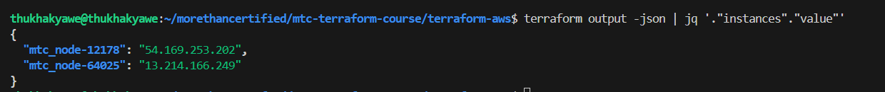

# mtc-terraform-course
More Than Certified Terraform

Commands List

Explanation:

docker_image.nodered_image.image_id: which is the ID of the pulled Docker image.

network_data[0].ip_address: This accesses the first network interface data of the container and retrieves its IP address.

## To create a new Terraform workspace named "dev"

```
terraform workspace new dev
```



## To display the name of the current active workspace in your Terraform setup

```
terraform workspace show
```


## To display a list of all the available workspaces in your current Terraform project

```
terraform workspace list
```


##  To switch to the dev workspace in your Terraform project

```
terraform workspace select dev
```

